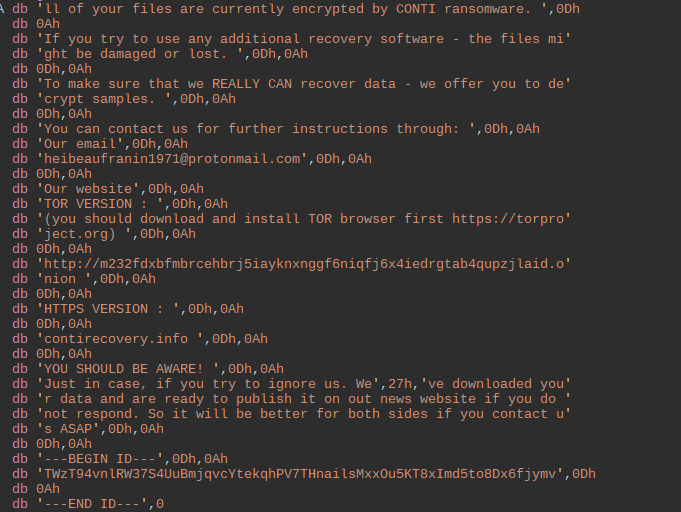

>NOTE: This is a copy of the blog originally posted on my blog at https://saza.re/posts/


After reading about a devestating attack on the Irish Health Services (article [here](https://www.irishtimes.com/news/health/cyberattack-on-hse-scale-of-damage-on-systems-will-not-be-known-for-days-1.4565621)), I decided to take a deeper look at what makes the Conti ransomware so devestating. The malware, that some consider to be the [successor](https://www.bleepingcomputer.com/news/security/ryuk-successor-conti-ransomware-releases-data-leak-site/) to the ryuk ransomware has been wreaking havoc on organisations over the last year, infecting nearly 200 companies. The ransomware is a classic example of a Ransomware-as-a-Service (RaaS) employing highly skilled operators to break into big big company networks and execute the payload in exchange for a share of the profit. 

Some research has been done into Conti such as [this detailed write-up](https://blogs.vmware.com/security/2020/07/tau-threat-discovery-conti-ransomware.html) by the folks over at theCarbon Black Threat Analysis Unit (TAU). However, the sample they analysed and the sample under analysis in this blog differ significantly in a few places, indicating we might be dealing with an updated version. 

I hope this blog provides some key insights to researchers and incident response teams that encounter this version of Conti.

# Table Of Contents
1. [Info](#info)
2. [Packer](#packer)
	* [Stage 1](#stage1)
	* [Stage 2](#stage2)
	* [Stage 3](#stage3)
3. [Payload](#payload)
	* [Deobfuscation](#deobfuscation)
		* [Strings](#strings)
		* [API Hashes](#api_hashes)
		* [Dead Code](#dead_code)
	* [Mutex](#mutex)
	* [Commandline](#cli)
	* [Encryption Loop](#enc_loop)
		* [Asynchronous Programming](#async)
		* [Encryption](#enc)
	* [Network](#network)
		* [ARP](#arp)
		* [Share Enumeration](#shares)
		* [Port Scanning](#port_scan)
	* [Shadowcopy](#shadowcopy)
4. [Conclusion](#conclusion)
5. [Appendix](#appendix)
	* [Appendix A](#appendix_a)
	* [Appendix B](#appendix_b)

# Info <a name="info"></a>
Hashes
```
Binary
md5    : 8fe7bfef6ebc53e9047561d35555cd24
sha256 : 707b752f6bd89d4f97d08602d0546a56d27acfe00e6d5df2a2cb67c5e2eeee30

Dropped payload
md5    : e396ec78e69d9464900b33989b2cbf52
sha256 : 52cdd111a81bb7b55b1bab28d19014fda0cfc323c11dcb6e9f8e60112eac8b1d
```

IOCs
```
Mutex:
kjkbmusop9iqkamvcrewuyy777

Encrypted file extension:
.KCWTT

Websites:
http://m232fdxbfmbrcehbrj5iayknxnggf6niqfj6x4iedrgtab4qupzjlaid[dot]onion
https://contirecovery[dot]info
```


# Packer <a name="packer"></a>
As is usual with malware of any kind, we will see a lot of layers of packing and loading before getting to the actual payloads. Let's take a quick look at the different stages, not because they're particularly groundbreaking, but because they can tell us a little bit about how the authors work. 

## Stage 1 <a name="stage1"></a>


The first packer's code seems fairly concise:


### unpacking <a name="unpacking1"></a>
Doing a small key initialisation on `4lIzzSbq#>J1v*CSIr#ofX3Bh%)f$3CQSdkz!vnUspXDIu4RJYNXVaE#%uS)` using a byte swapping style algorithm before using a xor decrypt algorithm to decrypt the 2nd stage. It's interesting to note that it's using `printf` statements, which might indicate that this is code that was originally benign and got repurposed by the malware author:


We will see later that logging output is a central component of the entire malicious executable.

Decrypting this stage is as simple as breaking on the `call esi` instruction after decrypting the payload.

## Stage 2 <a name="stage2"></a>
Open the unpacked and dumped region in IDA and let's start looking for things that will let us identify an infected system.

### Imports <a name="imports"></a>
As the code we're looking at was decrypted from a blob and loaded into an already running process, the windows loader hasn't been triggered to insert the addresses of any imported functions. Knowing this, the malware needs to fix the imports themselves dynamically. One common method that also adds a layer of obfuscation is through the use of API name hashes. 

In the very first function that gets called inside of the unpacked code we can already see a pattern that could indicate that API hashing is used to locate system functions:


As the API lookup function is used only here, there's no need to write a fancy script to deobfuscate them as we could quickly run through it using a debugger.

The imported functions in order are:
```
LoadLibraryA
GetProcAddress
VirtualAlloc
VirtualProtect
ZwFlushInstructionCache
GetNativeSystemInfo
```

### Dynamic Image Loading <a name="image_loader"></a>
In the previous step we have been provided with a rough blueprint for the entire second stage. The order and names of the APIs and the general structure of the function tells us that we're dealing with a loader for an embedded pe file.

First we can see some checking for the mz magic value and indexing the `e_lfanew` field in the mz header:


Looking at where EAX gets loaded with a pointer we see:


Which gives us an offset inside of the unpacked blob, to which we navigate and find:


All very indicative of image loading shenanigans. We can pretty much disregard most of the functionality inside of this function now and dump the PE file it tried to load directly to file using IDAPython.


## Stage 3 <a name="stage3"></a>
As we were able to dump the embedded pe file, we continue our analysis in IDA. To get IDA to analyse this file properly we need to disable auto-analysis when loading the file. To start IDA's analysis off on the right track we need to create a function where the previous packer was going to jump at address `+0x27B0`. This lets IDA start from the real start function rather than the start defined in the exports. As it uses hard-coded pointers we also need to rebase the binary to where it expects to be using `edit -> Segments -> Rebase Program`.

### Tidying Up <a name="#cleaning_up"></a>
After properly loading the binary we're left with a fairly messy binary with no real indicators of what's going on. We get no imports, exports or strings except for these 2 (an indicator that we're looking at the fairly new Conti v3 rather than the old Conti v2):


and:



Looking at the starting function we can also see something slightly unusual. A call to a pointer inside of a pointer array:


The addresses give away that they're likely windows dll functions. Inside of x64dbg we can create an array of the data at that address and get the full list of functions:


After fixing this up in ida, our job becomes a lot easier. One thing to note is that this packer stage uses no API hashing, which is rather odd as we will see that every other stage including the payload does use it.

### Diving in <a name="diving in"></a>
At the address the previous unpacker dropped us off at we see a pointer to another `PE` file get loaded. Looking at the next function with, what appears to be, the main logic we see a lot of operations on the PE file's headers. The first real thing to note, besides the fact that it's probably another loader, is that it is incredibly clean code. The code's structure and perfect error checking are very unlike what you would expect from a stealthy quick and dirty malware binary.

Doing a bit of searching around we encounter a fairly popular [github repo](https://github.com/fancycode/MemoryModule/blob/master/MemoryModule.c) that implements functionality for loading PE files from memory rather than disk. That doesn't sound much unlike what we might be looking at right here!

Looking at the entry point for the github repo we can see:


Which seems to match perfectly with the entry point of the binary we're looking at:


### Execution path <a name="execution_path"></a>
We are fairly sure that the code that we're looking at is a near exact copy of the code in the repo. We would like to get past the loaders code, so next we would like to figure out where the module hands over execution to the loaded file. Looking at the source code on the github we can discover 3 potential paths for code to continue:
* A tls callback is called (unlikely but possible)
* DllMain is called if the loaded image is a dll
* a pointer to a struct describing the loaded image is returned, which can be passed back to other functions inside the code such as `MemoryCallEntryPoint()`.

Using the source we can isolate those points:


> One thing to note is that the malware author forces the execution path to go down the dll path by setting `edx` to 1 before the `test edx, edx; jz short loc_11B1470;`. It is highly unlikely the compiler wouldn't optimize the dead code-path out. Are they making binary edits?

Either way we can now go back to the debugger and set breakpoints on the ExecuteTls function, the dllmain call and the return of the function. We end up seeing no TlsCallbacks being called and break on the DllMain call. Stepping into the call will bring us to the DllMain of the image that just got loaded. We leave the debugger again and just dump the PE image we saw earlier straight from IDA's data and load it into its own IDA instance.

# Payload <a name="payload"></a>
This marks the start of the analysis of the actual malicious ransomware component. Here we'll see how Conti doesn't stray very far from the norm, but employs all the usual techniques in just an ever so slightly different way. The obfuscation in this sample is abundant, the code very asynchronous and the impact big. Let's dive in.


## Deobfuscation <a name="deobfuscation"></a>
The first step to understanding the payload is getting rid of the multiple layers of obfuscation. Looking through the binary we can identify 3 methods of obfuscation:
* A push of a byte + dword, then a call to a function followed by a call to return value of that function (API lookup by hash)


* many single byte moves onto the stack followed by a function call (string obfuscation)


* Large amounts of dead code insertion

 

### Strings <a name="strings"></a>
Starting with the string obfuscation we can see that each string comes with its own unique deobfuscation function, rather than 1 generic function. Each function doesn't differ much in logic, just the used registers and increment/decrement values change.

As each function is unique and there's also a lot of inlined versions, it's going to be difficult to automatically deobfuscate them. Using a debugger to deobfuscate them is going to be incredibly laborious as you would have to break after each inlined function and on each unique function. A script is clearly the way to go here. This script should perform the following things:
* Use heuristics to identify each unique deobfuscation function
* harvest the input bytes provided to the function (the obfuscated string)
* Execute the deobfuscator

#### Heuristics <a name="heuristics"></a>
While each string decryption function is unique, they're still very similar in structure. We can find 90%~ of them using a few well-made byte search strings with wildcards. Copying the opcodes of a few of these functions into a text editor we get the following:


Using this method we can identify a few solid binary search strings such as the following:
```python
search_strings = ["0x8A 0x44 ? ? 0x0F 0xB6 ?", "0x8A ? ? ? ? ? ? 0x0F 0xB6 ?", "0x8A ? ? ? ? ? ? 0xB9 ?"]

```
We will use these strings in combination with the `idc.find_binary()` API to locate most of the functions.

#### Input Bytes <a name="input_bytes"></a>
The second piece of the puzzle that is required to automate the deobfuscation is harvesting the input bytes pushed to each of their respective deobfuscation functions. Getting these bytes into our IDAPython requires a bit more work.

Looking through a lot of the byte pushes we can tell most strings start off with a `0` byte push, but this isn't always the case. Not only that, but every now and then you have a string that has `0` byte pushes in the middle. Identifying the end of the pushes also appears to be finicky.

The most consistent way is identifying the stack offset that gets loaded into `ecx` as this marks the start of the string. From there we can load all bytes that got moved to a stack address until we reach either the function call or the start of the inline function:


```python
def harvest(start, end):
	b = bytearray()
	insn = ida_ua.insn_t()

	while start != end:
		ida_ua.decode_insn(insn, start)

		if (insn.itype == idaapi.NN_mov) and (insn.Op2.type == o_imm):
			b.append(insn.Op2.value)

		start = idc.next_head(start)

	return b
```


#### Executing The Obfuscator <a name="obfuscator"></a>
At this point we have the addresses and input for most if not all of conti's obfuscated strings. All that rests us now is to run each unique deobfuscation function with the right input through an emulator and print the output. Running the emulator from inside IDAPython allows us to write our results back into the database, keeping everything in 1 place. For this let's use the `flare-emu` emulator by fireeye: [flare-emu](https://github.com/fireeye/flare-emu).

To emulate each function we need to take the following steps:
* Set up an emulator instance
* Load the input bytes into the emulator's address space
* Emulate the function
* Get the output

Here's my implementation:
```python
def emulate_func(ea, b):
	eh = flare_emu.EmuHelper()
	ret = eh.loadBytes(b)

	eh.emulateRange(ea, registers = {"ecx":ret}, hookApis=False)

	emu_bytes = eh.getEmuBytes(ret+1, len(b))

	# Check if unicode string or not
	if emu_bytes[1] == 0x00:
		bb = bytearray()
		for i, x in enumerate(eh.getEmuBytes(ret, len(b))):
			if (i & 1):
				bb.append(x)
		print(bb.decode())
		string = bb.decode()
	else:
		print(eh.getEmuString(ret+1).decode())
		string = eh.getEmuString(ret+1).decode()

	# Set repeatable function comment with deobfuscated string
	ida_funcs.set_func_cmt(idaapi.get_func(ea), idc.get_func_cmt(ea, 1) + "\n" + string, 1)

```


The entire script for the unique function based deobfuscation can be found [here](https://github.com/lldre/conti_blog/blob/master/scripts/conti_function_string_deobfuscation.py)

The script for the inline version can be found [here](https://github.com/lldre/conti_blog/blob/master/scripts/conti_inlined_string_deobfuscation.py)

For a complete overview of the strings I was able to dump see [Appendix A](#appendix_a).


### API hashes <a name="api_hashes"></a>
Again we are faced with an API lookup by hash type of obfuscation. What's interesting is that the way it is implemented quite significantly differs from the one in the packer. This indicates to me that either the packer was borrowed code or a big distributed team is working on different parts of the malware at the same time. 

As the payload is quite extensive, it would serve us well to automate the deobfuscation of the hashes. Looking at the way the deobfuscation is used we can identify that EAX is where the located function pointer is stored upon returning. Now it would be tempting to break at the start of the function and the end and correlate all the pushed hashes with the returned pointer values, but due to the fact that Conti spawns many threads you're gonna have a bad day with all the desynched output. Instead we make use of the 32bit nature of the malware and only hook the returns. At the return the pushed hash `DWORD` should still be in-tact on the stack and EAX should contain the actual pointer.

#### x64dbg Script <a name="x64dbg_script"></a>
We use x64dbg for scripting this out, because it's incredibly easy to use and very performant. We don't have to consider ASLR or any of that, all we need is a breakpoint at the start of the payload after the packer stages. The approach proposed above looks like this:
```
bc

// returns of API lookup func
bp 0x405256
bp 0x4052AF
bp 0x4051E0
bp 0x405197

LOOP:
run

// save pushed hash DWORD and resolved fptr
mov $hash, [esp+4]
mov $addr, eax

log "HASH: {$hash} | ADDR: {addr}"

jmp LOOP
```

Sadly I was unable to find a way to extract the names for each pointer automatically. `x64dbg` does have this knowledge when you look in the debugger, but no API to access the information. Maybe `MrExodia` can shed a light on how you could achieve looking up symbolnames for pointers from a script. For now we can quickly sort and weed out each unique entry using your favorite tool. From there we can manually lookup the symbolname for each pointer in the debugger.

The results for this particular version of the binary can be found in [Appendix B](#appendix_b). Here's a little script you can use to lookup said hashes and insert the corresponding name back into IDA:

```python
import idc
import idaapi
import idautils

api_list = [0x0D54E6BD3, "SetFilePointerEx", 0xC45F4A8C, "WriteFile", 0xEDE8A61E, "SetEndOfFile", 0x0A5EB6E47, "CloseHandle", 0x4D9702D0, "lstrcpyW", 0x7BA2639, "lstrcatW", 0xC8FB7817, "MoveFileW", 0xE2B40F85, "FindFirstFileW", 0x397B11DF, "lstrcmpw", 0x1FBBB84F, "GetLastError", 0x9AEA18E1, "FindNextFileW", 0x75FCF770, "FindClose", 0x1972BF90, "Wow64DisableWow64FsRedirection", 0x78EE4DFA, "Wow64RevertWow64FsRedirection", 0x0EEDEC24B, "VariantClear", 0x7324A0A2, "CreateProcess", 0x21CCA665, "RtlEnterCriticalSection", 0x1D7AB241, "WaitForMultipleObjects", 0xE4B69F3B, "Sleep", 0xD72E57A9, "lstrcmpiw", 0x55D15957, "setsockopt", 0xE34EA561, "getsockopt", 0x55710126, "GlobalAlloc", 0xE558706F, "WSASocketW", 0xB87C8BB7, "exit", 0x87B69CC9, "CreateTimerQueueTimer", 0x1668D771, "NetShareEnum", 0x57B499E3, "CreateIoCompletionPort", 0x5DACC2BA, "WSAAddressToStringW", 0x4310229A, "bind", 0x441BDF1E, "PostQueuedCompletionStatus", 0x19515AB5, "CancelIo", 0x4118BCD2, "closesocket", 0xA0EE5AAD, "GlobalFree", 0x61856121, "shutdown"]


for i in range(0, len(api_list), 2):

	start = idaapi.get_imagebase()
	while True:
		ea = idc.find_imm(start, SEARCH_NEXT|SEARCH_DOWN, api_list[i])[0]
		if ea != BADADDR:
			start = ea+1
		else:
			break

		insn = ida_ua.insn_t()
		ida_ua.decode_insn(insn, ea)

		if (insn.Op1.type == o_imm):
			print("Inserting %s at %x for hash %x"%(api_list[i+1], ea, api_list[i]))
			idc.set_cmt(ea, api_list[i+1], 0)
```

### Dead Code <a name="dead_code"></a>
The entire payload is littered with dead code insertions, making it very hard to follow the actual important data. Code such as the following takes in important data returned from previous malicious functions and appears to be doing calculations on it:


However, on second look it isn't actually using any of the calculated data later on indicating it is just dead code. If we take a look at the big control flow graph of the main function we can see this:


A lot of repeating patterns of `branch into 2 paths -> a few loops -> converge back to 3 basic blocks -> return to actual code` can be spotted throughout:


Looking through these code paths, we can conclude that nothing actually happens and we can group the basic blocks together with a nice `ctrl + drag` into `right click -> group nodes` action and bring the main function down to its actual contents:


## Mutex <a name="mutex"></a>
The very first thing it will do is create/check a mutex to confirm the malware hasn't been executed yet:


## Commandline Arguments <a name="cli"></a>
After confirming this is the first run it gets a list of command line arguments using `GetCommandLineW`. Having obtained a list of arguments, if any, it proceeds to decrypt all its predefined argument strings and comparing them to the list received from the previous function call:


 
The available flags in this version are:
```
-p
-m
-nomutex
-size
-log
```
The `-p` and `-m` flags are the only flags with any significant change to the control flow of the payload, but it's good to take note of the `-log` flag. The fact that there's log functionality, means we get very detailed information about some of the custom logic in this binary.


The `-m` flag has 4 possible values:
```
backups
net
local
all
```

Depending on which value is passed (or if no `-m` flag is supplied `-m all` is assumed), the binary executes significantly different code. When relevant I`ll try to note to which code path the functionality belongs. If no note is given then it can be assumed it was part of all paths.

## Encryption Loop <a name="enc_loop"></a>
Arriving at the main functionality of the ransomware payload. In here Conti will spawn threads to encrypt all files that aren't on the exclusion list.

> This function is executed twice if `-m all` was set, once for local files and once for network shares. In case of `-m local` only the local variant is executed and in case of `-m net` the network shares one. In both cases the amount of threads spawned is equal to the `dwNumberOfProcessors` member returned by `GetNativeSystemInfo`.
> If the `-p` flag is provided it limits the amount of threads to 1 and uses the value given after the `-p` as input for `FindFirstFile`. This means the `-p` flag can be used to encrypt an entire disk, a single file or a directory.

The encryption function starts by loading a statically inserted and readily available RSA key using the Microsoft crypto library. RSA key shown here:


After this it will start looping through directories looking for files to encrypt, but before I get to that I need to digress.

### Asynchronous Programming <a name="async"></a>
Before I get into the details of the file encryption I want to explain how Conti uses asycnchronous programming. Not only is it a fundamental part of the way it supplies data to both the local and network encryption routines, but also between internally spawned threads. As it's an absolute pain to statically comprehend the control flow, I think it's a good idea to at least write a bit about the technical details for future reference.

Following normal functional programming practices, which most malware uses, you expect the rough flow of ransomware to be:

1. Enumerate local disks
2. Encrypt
3. Enumerate network shares
4. Encrypt
5. Delete shadowcopies
6. Zero out important memory such as encryption keys

When you apply asynchronous programming in a way Conti has done the control flow will become:

1. Start many blocked encryption threads
2. Delete shadowcopies
3. Enumerate local disks
	1. Each loop passes data back to encryption function
	2. Immediately zero strings after done using
4. Share enumeration
	1. Asynchronously start ARP enumeration
	2. Asynchronously start share enumeration
	3. Asynchronously start connecting
	4. Pass data back into encryption thread
	5. Wait for all objects to finish
5. Wait for all threads to finish
6. Zero everything


If you're looking at the a thread wondering where the data is coming in and why it appears to just be calling sleep in a loop, this might be why!

In essence the way Conti implements this is by using a `"global"` control struct which guides the threads that contains a linked list and some other parameters. When the malware spawns the encryption threads it will automically check the linked list using `RtlEnterCriticalSection` and `RtlLeaveCriticalSection` in a loop, waiting for it to get filled up:


The linked list will get filled later on with std::string objects containing the paths to data to encrypt. When the main thread starts filling the list the previously blocked thread will start doing its actual work. 

Similarly, later on, we will encounter some synchronization structs that employ the same method of blocking execution while waiting for the main thread to calculate the necessary data, but this time between internal worker threads. Add to this a layer of IOCP programming and obfuscated API calls (that you haven't yet fully deobfuscated, because every damn deobfuscation function is unique) and you have the perfect recipe for not knowing where the f*ck the data is coming from!

### Encryption <a name="enc"></a>
Asside from the asynchronous providing of drive strings, the encryption loop itself is bog-standard. Looping over each directory and file using `FindFirstFile` and `FindNextFile` writing a ransom note out to file containing the following text:


Skipping symbolic links, the `C:\` directory file and the `..` directory file. Going through the following list of excluded folders:
```
"tmp"
"temp"
"winnt"
"thumb"
"$Recycle.Bin"
"$RECYCLE.BIN"
"System Volume Information"
"Boot"
"Windows"
"Trend Micro"
```

Inside of these folders it will skip any `.dll`, `.lnk`, `.sys` and `.msi` file as well as files named `bootmgr`, `readme.txt`, or `CONTI_LOG.txt`. Everything else is encrypted.


#### Encryption State <a name="enc_state"></a>
Before encryption starts Conti sets up an internal state that will later also be appended to the file its about to encrypt. The state is unique for each individual file looks as follows:

```
struct file_tracking{
+0x00 char 	*filename
+0x04 HANDLE file_handle
+0x08 LARGE_INTEGER.LowPart filesize_low
+0x0C LARGE_INTEGER.HighPart filesize_high
+0x10 "expand 32-byte k" Salsa20 sigma
+0x20 Same 0x20 random bytes as +58
+0x40 0
+0x44 0
+0x48 8 random bytes from +50
+0x50 CryptGenRandom(8 bytes)
+0x58 CryptGenRandom(20 bytes)
+0x78 Same 0x20 random bytes as above
+0x98 8 random bytes from above +50
}
```

The part starting at offset `+0x78` is passed into `CryptEncrypt(PROV_RSA_AES)` which uses the `RSA_KEY` loaded earlier. This encrypted data is later appended to the file before it gets encrypted, so we can assume we're looking at the encryption key generation here.

#### File Encryption <a name="f_enc"></a>
Before determining the attributes of the file, it tries to open the file to check if there isn't a lock on it. If another process has a lock on the file it will attempt to terminate the locking process:


This function name appears to be the actual function name the authors gave it, inferring from the decrypted error log message `KillFileOwner for file %s - success`.

After getting a lock on the file it parses 2 file attributes:
* File Extension
* File Size

Then, depending on these 2 attributes, it will write different values to a small information struct that is later appended. This struct has the following shape:
```
struct fileinfo
{
BYTE magic1
BYTE magic2
DWORD filesize_low
DWORD filesize_high
}
```

If the file extension matches one of the ~100 database storage file extensions it checks for it will set `magic1` to `0x24` and `magic2` to `0`. These file extensions appear to all be related to database storage files used by software to store data. A few examples include:
```
.idb
.jet
.sql
.maw
```
> Don't store your IDA database on the same machine you're debugging the malware on ;)

If the file extension matches one of the ~20 disk image extensions it will set `magic1` to `0x25` and `magic2` to `0x14`. A few examples include:
```
.vhdx
.iso
.bin
.raw
.nvram
```

If the file name matches none of these extensions it will check if the file is larger than `0x500000` bytes and if that's the case set `magic1` to `0x25` and `magic2` to `0x32`. If it's between `0x100000` and `0x500000`, set `magic1` to `0x26` and `magic2` to `0x0`. And the default case sets `magic1` to `0x24` and `magic2` to `0x0`.

Following this check it will write the RSA encrypted randomly generated key and the file_info state to the end of the file it's about to encrypt. The encryption takes place using the `Salsa20` encryption algorithm. After encryption it will load the string ".KCWTT", which is ironically one of the only strings not obfuscated, and append it to the original filename to indicate it's infected:


## Network <a name="network"></a>
If the `-m net` or `-m all` flag was passed Conti will spawn several threads activating network discovery functionality. This functionality will eventually provide a list of available shares back to the same function that was responsible for encrypting the local disk. In the same was the local encryption queue got filled, the network encryption queue also gets filled asynchronously.

To generate a list of shares Conti takes the following steps:
* ARP cache checking
* Share enumeration
* "port scanning"

### ARP <a name="arp"></a>
By now a fairly common method in ransomware, but worth mentioning none-the-less. The payload uses GetIpNetTable to read out the ARP cache, which stores IPs that have been accessed before. From these IPs it will filter out all the local network related IPs and save them. The IPs it check for contain the following:
```
172. 
192.168.
10.
169.
```

The only thing that stands out is the `169.` address which is an address given by `APIPA` if a computer is unable to reach the `DHCP` server.

### Share Enumeration <a name="shares"></a>
The IPs discovered in the ARP discovery thread are passed to the share enumeration thread using an internal struct that ensures thread safety using critical sections. Once an IP has been identified the share enumeration thread will unblock and use `NetShareEnum` to enumerate all shares on that IP.

In the information returned, Conti will check if it contains the string `ADMIN$` and skip it if it finds it. For all the other shares it will format a string like `\\{IP}\\{sharename}` and save this back to the internal linked list of network data structs.

### "Port Scanning" <a name="port_scan"></a>
The logging functionality that Conti comes with tells us that this thread is supposedly responsible for port scanning judging from the string `Can't create port scan thread.`. However, it only attempts to access one port: `port 445`.

This thread once again works using the same blocking mechanism that all the other threads use while waiting for data input. The second a network share gets identified that is available on one of the local IPs found by the ARP scan it gets passed to this function. The function then uses `IOCP programming` to pass handles to open shares back to the encryption thread that was started at the beginning of the payload.

To get these handles the malware it creates a linked list of network data objects that contains sockets, addresses and completion port handles. For each share passed to the function it will create a socket using `WSASocketW` and have it assigned a random port. To this it will bind a completion port using `CreateIoCompletionPort` for use in the asynchronous passing of data using overlapped data structs. It will then queue a timer using `CreateTimerQueueTimer` to queue a call to `PostQueuedCompletionStatus` which passes a key value of `2` back to the `GetQueuedCompletionStatus` function. It seems to use this combination only to guide the control flow for this function: 


From each of the created sockets it will attempt to connect to the remote share using `ConnectEx`.

> Conti uses ConnectEx to combine multiple operations into one. This API isn't exported normally and needs to be obtained by a call to `WSAIoctl` passing the ioctl `SIO_GET_EXTENSION_FUNCTION_POINTER` together with the 16-byte GUID for the ConnectEx function. The guid for this this function needs to be looked up in the [MSWSock.h](https://github.com/tpn/winsdk-10/blob/master/Include/10.0.10240.0/um/MSWSock.h) header.

If `ConnectEx` returns `WSA_IO_PENDING` it will attempt to clear the IO by using `CancelIo` before passing it to the encryption thread. 

If the `-m net` or `-m all` argument was passed, the main thread will block here using `WaitForSingleObject` to wait for all threads to finish.


## Shadowcopy <a name="shadowcopy"></a>

For the deletion of any shadowcopies that are present on the system Conti uses a combination of COM objects and the commandline. 

> This functionality is executed in all cases except for when the `-p` flag has been provided. In this case it skips straight to the end of the payload.

Starting with getting a handle to `wbemprox.dll`'s `IID_IWbemLocator` interface and, depending on if the system is 64bit, get a handle to `fastprox.dll`'s `IID_IWbemContext`'s context. If the system is 64bit it sets the `_ProviderArchitecture` to 64. Following the usual `ConnectServer("ROOT\\CIMV2", ......)` and `ExecQuery("WQL", "SELECT * FROM Win32_ShadowCopy", ......)`, Conti starts to divert from the usual path ever so slightly. Rather than looping over all the shadow copies, getting their ID `IWbemClassObject::Get("ID", .......)` and calling `IWbemServices::Delete` function on it, it goes down a different path. While getting the ID of each shadowcopy on the system in a loop, it uses that ID in the following string and executes it to delete the shadowcopy:
`cmd.exe /c C:\Windows\System32\wbem\WMIC.exe shadowcopy where "ID='%s'" delete`. We can thus expect a lot of shells being spawned during shadowcopy deletion.

The full pseudocode for deletion is:
```c
IWbemLocator = CoCreateInstance(wbemprox_dll_clsid, 0, 1, IID_IWbemLocator_interface_clsid)

if x64_system:
	
	IWbemContext = CoCreateInstance(fastprox_dll_clsid, 0, 1, IID_IWbemContext_interface_clsid)
	IWbemContext::SetValue("_ProviderArchitecture", 0, 64)


IWbemServices = IWbemLocator::ConnectServer("ROOT\\CIMV2", ......)
for copy in IWbemServices::ExecQuery("WQL", "SELECT * FROM Win32_ShadowCopy", ......):

	ID = IWbemClassObject::Get("ID", .......)
	wsprintfw(cmdline, "cmd.exe /c C:\Windows\System32\wbem\WMIC.exe shadowcopy where "ID='%s'" delete", ID)
		
	Wow64DisableWow64FsRedirection()
	CreateProcess(NULL, cmdline, .......)
	Wow64RevertWow64FsRedirection()
```

# Conclusion <a name="conclusion"></a>
Conti's code, while not particularly ground-breaking, is incredibly destructive when used in a targeted attack. When used by an operator during an attack it no longer has to consider AV or communicating with a c2c server. Pair that with the ability to guide the ransomware using command-line arguments and give the operator output through logging, it is a piece of kit that shouldn't be underestimated.


If you are dealing with a ransomware attack in which this version was involved and still have questions after reading this blog, feel free to reach out [here]().


# Appendix <a name="appendix"></a>
Some of the information gathered during the analysis.

## Appendix A <a name="appendix_a"></a>
List of strings dumped from the last stage of the Conti malware. (not ordered)

```
kernel32.dll
OleAut32.dll
Shlwapi.dll
Shell32.dll
Iphlpapi.dll
Rstrtmgr.dll
Iphlpapi.dll
Advapi32.dll
Kernel32.dll
ws2_32.dll
ntdll.dll
Shlwapi.dll
Advapi32.dll
User32.dll
Can't gen key for file %s. GetLastError = %lu
.avhd
.vhd
.fm5
.xmlff
.trm
.spq
.sas7bdat
.p97
.nsf
.myd
.lgc
.idb
.frm
.exb
.dp1
.cpd
.arc
.dbv
.accdr
SELECT * FROM Win32_ShadowCopy
WQL
ROOT\CIMV2
Boot
[%02d:%02d:%02d]
-p
kjkbmusop9iqkamvcrewuyy777
backups
net
local
all
-nomutex
-m
-size
Can't create port scan thread.
\\
172.
GetIpNetTable fails. GetLastError = %lu
Microsoft Enhanced RSA and AES Cryptographic Provider
Provider
Can't write key for file %s. GetLastError = %lu
Can't get subnets.
Can't create io completion port.
Can't get ConnectEx.
Microsoft Enhanced RSA and AES Cryptographic Provider (Prototype)
Found %d drives:
netapi32.dll
ws2_32.dll
Ole32.dll
FindFirstFile fails in directory %s. GetLastError = %lu.
..
c:\\
Trend Micro
Windows
System Volume Information
$RECYCLE.BIN
$Recycle.Bin
thumb
temp
winnt
tmp
readme.txt
bootmgr
.dll
.lnk
.sys
.msi
readme.txt
CONTI_LOG.txt
.KCWTT
kernel32.dll
ntdll.dll
OleAut32.dll
.4dd
.adb
.ade
.adf
.adp
.nv
.pvm
.raw
.bin
.vsv
.iso
Windows
Trend Micro
.lnk
CONTI_LOG.txt
.accdb
.accdc
.accde
.accdt
.ora
.btr
.bdf
.cdb
.dad
.dadiagrams
.db3
.dbf
.dbs
.dbt
.dbx
.dct
.dcx
.ddl
.dqy
.dtsx
.dxl
.ecx
.fdb
.fp3
.fp5
.fp7
.fpt
.gdb
.grdb
.gwi
.hdb
.his
.ihx
.jet
.jtx
.kexi
.maf
.mdf
.mrg
.mud
.mwb
.ndf
.nrmlib
.ns2
.ns3
.nyf
.odb
.pdb
.rctd
.rodx
.rpd
.rsd
.sbf
.sdb
.sdc
.sdf
.sql
.sqlitedb
.tmd
.udl
.wdb
.wmdb
.wrk
.xdb
.xld
.abcddb
.abx
.accdw
.adn
.hjt
.kdb
.lut
.mdn
.subvol
.vmrs
.avdx
.vmcx
$RECYCLE.BIN
System Volume Information
ID
cm
.accft
.ask
.cat
.ckp
.cma
.dacpac
.daschema
.db-shm
.db-wal
.dbc
.dcb
.dlis
.dsn
.eco
.edb
.epim
.fcd
.fic
.fmp
.fmp12
.fmpsl
.fol
.fp4
.itw
.kdb
.kexic
.kexis
.lwx
.maq
.mar
.mas
.mav
.mdb
.mpd
.nnt
.ns4
.nwdb
.oqy
.owc
.p96
.pan
.pdm
.pnz
.qry
.qvd
.rbf
.rod
.scx
.sis
.sqlite3
.temx
.tps
.trc
.udb
.usr
.v12
.vis
.vpd
.vvv
.abs
.db2
.icr
.maw
.mdt
.vmsn
.vmsd
.nvram
.qcow2
.vhdx
$Recycle.Bin
explorer.exe
ID
cm
.accft
.ask
.cat
.ckp
.cma
.dacpac
.daschema
.db-shm
.db-wal
.dbc
.dcb
.dlis
.dsn
.eco
.edb
.epim
.fcd
.fic
.fmp
.fmp12
.fmpsl
.fol
.fp4
.itw
.kdb
.kexic
.kexis
.lwx
.maq
.mar
.mas
.mav
.mdb
.mpd
.nnt
.ns4
.nwdb
.oqy
.owc
.p96
.pan
.pdm
.pnz
.qry
.qvd
.rbf
.rod
.scx
.sis
.sqlite3
.temx
.tps
.trc
.udb
.usr
.v12
.vis
.vpd
.vvv
.abs
.db2
.icr
.maw
.mdt
.vmsn
.vmsd
.nvram
.qcow2
.vhdx
$Recycle.Bin
explorer.exe
File %s is already open by another program.
Can't open file %s. GetLastError = %lu
KillFileOwner for file %s - error. GetLastError = %lu.
Can't get file size %s. GetLastError = %lu
cmd.exe /c C:\Windows\System32\wbem\WMIC.exe shadowcopy where "ID='%s'" delete
Starting search on share %s.
```

## Appendix B <a name="appendix_a"></a>
Results from the x64dbg API hash dump script to which was added the results of  manually looking up the symbol for each of the ADDRs.
```c
0x0D54E6BD3 : "SetFilePointerEx"
0xC45F4A8C  : "WriteFile"
0xEDE8A61E  : "SetEndOfFile"
0x0A5EB6E47 : "CloseHandle"
0x4D9702D0  : "lstrcpyW"
0x7BA2639   : "lstrcatW"
0xC8FB7817  : "MoveFileW"
0xE2B40F85  : "FindFirstFileW"
0x397B11DF  : "lstrcmpw"
0x1FBBB84F  : "GetLastError"
0x9AEA18E1  : "FindNextFileW"
0x75FCF770  : "FindClose"
0x1972BF90  : "Wow64DisableWow64FsRedirection"
0x78EE4DFA  : "Wow64RevertWow64FsRedirection"
0x0EEDEC24B : "VariantClear"
0x7324A0A2  : "CreateProcess"
0x21CCA665  : "RtlEnterCriticalSection"
0x1D7AB241  : "WaitForMultipleObjects"
0xE4B69F3B  : "Sleep"
0xD72E57A9  : "lstrcmpiw"
0x55D15957  : "setsockopt"
0xE34EA561  : "getsockopt"
0x55710126  : "GlobalAlloc"
0xE558706F  : "WSASocketW"
0xB87C8BB7  : "exit"
0x87B69CC9  : "CreateTimerQueueTimer"
0x1668D771  : "NetShareEnum"
0x57B499E3  : "CreateIoCompletionPort"
0x5DACC2BA  : "WSAAddressToStringW"
0x4310229A  : "bind"
0x441BDF1E  : "PostQueuedCompletionStatus"
0x19515AB5  : "CancelIo"
0x4118BCD2  : "closesocket"
0xA0EE5AAD  : "GlobalFree"
0x61856121  : "shutdown"
```